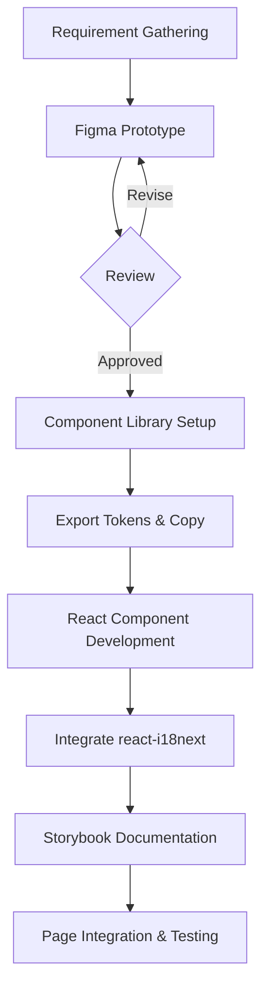

## Project Background: Current State & Pain Points

- **Current State**
  - The existing KubeEdge Dashboard lacks a unified visual language; component styles are inconsistent and there is no systematic design standard.
  - User interactions are not intuitive: workflows are cumbersome, form feedback is delayed, and button responses and status messages vary across pages.
  - The UI only supports English; Chinese users face a language barrier.
  - No internationalization (i18n) framework is in place, making it costly to add new languages in the future.
- **Pain Points**
  1. **Visual Inconsistency**: Colors, typography, and spacing differ between pages, causing cognitive overload.
  2. **Redundant Interactions**: Common tasks require multiple clicks; error messages are unclear, hindering quick issue resolution.
  3. **Poor Form Experience**: Validation cues and placeholder texts are vague, with insufficient pre- and post-submission feedback.
  4. **Lack of Chinese Support**: All UI text and documentation are in English, excluding non-English-speaking users.
  5. **No i18n Framework**: Adding additional languages requires reworking the codebase and design files.

------

## Goals

1. **Integrate Internationalization**: Use `react-i18next` (or MUI's built-in i18n) to enable dynamic English/Chinese language switching.
2. **Centralize Copy Management**: Extract all UI text into configurable resource files (`en.json`, `zh.json`) and manage them centrally.
3. **Unify UI Style & Improve Interactions**: Standardize button, form, and table styles; enhance form validation and empty-state prompts.
4. **Optimize for Multiple Viewports**: Improve responsiveness for mobile and small screens, ensuring accessibility across devices.
5. **Localize for Chinese Users**: Adapt table operations, pagination, date formats, and number separators to Chinese conventions.

------

## Proposals

### Project Scope

- Develop a new component library based on React and Figma designs.
- Rebuild key pages (Dashboard, Node Management, Application Management, Log Monitoring, Settings).
- Implement form components with validation logic.
- Integrate `react-i18next` and prepare `en.json`/`zh.json` language files.
- Create high-fidelity prototypes in Figma and produce a design specification document.
- Refactor the React + TypeScript codebase with unit tests.

### Target Users

- Kubernetes / KubeEdge platform operators
- Edge computing developers
- Enterprise operations teams
- Multi-language user communities

------

## Design Details

### 1. Architecture Design

- **Tech Stack**: React 18 + TypeScript for robust type safety and hook-based development.

- **Design Tool**: Figma for high-fidelity mockups, Design Token management, and collaborative design.

- **i18n Framework**: `react-i18next` to handle locale switching at runtime.

- **Folder Structure**:

  ```
  src/
  ├── design/       # Figma-exported Design Tokens (colors.json, spacing.json)
  ├── locales/      # Language files: en.json, zh.json
  ├── components/   # Atoms / Molecules / Organisms
  ├── pages/        # Page containers
  ├── hooks/        # Custom hooks (useI18n, useTokenSync)
  └── utils/        # Utility functions (copy loading, formatting)
  ```

- **Design Token Synchronization**:

  1. Define colors, typography, and spacing in Figma.
  2. Export tokens as JSON into `src/design/`.
  3. Use a hook or script to inject tokens into the Tailwind/MUI theme and Emotion CSS-in-JS.

- **Copy Management**:

  - Store all UI text in `src/locales/en.json` and `src/locales/zh.json`.
  - Use `t()` and `<Trans>` from `react-i18next` for dynamic copy rendering.

- **Accessibility & Performance**:

  - Implement `React.lazy` & `Suspense` for code-splitting.
  - Add ARIA attributes and keyboard support to components.

### 2. Module Design

- **Atomic Design Hierarchy**:
  - **Atoms**: Basic elements (Button, Input, Select) with variants (size, state) as defined in Figma.
  - **Molecules**: Combinations like `FormField` (Label + Input + ErrorMessage), `DatePicker`.
  - **Organisms**: Complex modules like `DataTable` (with paging, sorting, locale-aware formats), `SidebarNav`.
- **Localization Adaptations**:
  - Table and pagination components read locale settings for labels and buttons.
  - Format dates via `date-fns` with locale packs; format numbers with thousand separators and currency symbols.
  - Adjust component widths and text wrapping based on English/Chinese text length.
- **Responsive & Mobile**:
  - Use MUI Grid and Breakpoints for fluid layouts.
  - Implement `useMediaQuery` to adapt component behavior on small screens.

### 3. Method Design



- After each component is built, verify against the Figma prototype and showcase multi-language stories in Storybook.

### 4. Communication Design

- **Copy & UI Interaction**: Components consume text via `t()`; language toggles via `i18n.changeLanguage`.
- **Design Sync**: Regularly export updated tokens from Figma and sync with the React codebase.

### 5. Process Design

1. **Requirements & Prototype**: Gather requirements → Figma designs → review & approval.
2. **Component Development**: Build Atoms → Molecules → Organisms → document in Storybook.
3. **i18n Integration**: Configure `react-i18next` → import locale files → test EN/CN switching.
4. **Localization**: Validate table formats, date/time, and number formatting per locale → responsive tests.
5. **Testing & Release**: UI testing → accessibility audits → sync Storybook and Figma → publish component library.

------

## Road Map

**Week 1 (07/01-07/07): Environment Setup & Design System Initialization**

- Install Node.js, React, TypeScript, MUI, react-i18next, i18next plugins;
- Establish Figma Design System and import MUI Figma library;
- Create atomic component library in Figma and sync tokens to `src/design/`.

**Week 2 (07/08-07/14): Figma UI Prototyping**

- Create high-fidelity prototypes for key pages (Dashboard, Node Management, Log Monitoring, Settings);
- Collect feedback and refine interaction details.

**Week 3 (07/15-07/21): UI Development & i18n Integration**

- Implement MUI components in React based on Figma library;
- Initialize `react-i18next` and configure `en.json`/`zh.json`;
- Integrate language switcher and ensure all copy is managed in `locales/`.

**Week 4 (07/22-07/28): Integration Testing**

- Test i18n functionality and component compatibility on major browsers;
- Fix configuration, loading, or styling conflicts.

**Week 5 (07/29-08/04): Form Validation Implementation**

- Build reusable form validation logic (required fields, email, password strength);
- Integrate into React components with real-time error feedback.

**Week 6 (08/05-08/11): Localization Adaptations**

- Optimize table pagination, date formats (YYYY-MM-DD), number separators for Chinese locale;
- Adjust layout flexibly for English/Chinese text lengths.

**Week 7 (08/12-08/18): Responsive & Mobile Layout**

- Use MUI Grid & Breakpoints to implement adaptive layouts;
- Verify mobile and small-screen UI consistency.

**Week 8 (08/19-08/25): Full Integration & Bug Fixes**

- Validate language switching, form submissions, and responsive behaviors;
- Resolve compatibility and functional issues.

**Week 9 (08/26-09/01): Comprehensive Testing**

- Design test cases covering key scenarios (i18n, forms, tables);
- Log and prioritize bugs.

**Week 10 (09/02-09/08): Bug Fixes & Regression Testing**

- Resolve high-priority bugs;
- Conduct regression tests to ensure stability.

**Week 11 (09/09-09/15): Interaction Refinement**

- Polish click animations and validation feedback;
- Match animation durations and easing curves to Figma specs.

**Week 12 (09/16-09/22): Documentation & Delivery Preparation**

- Complete technical docs, code comments, usage guides, and Figma spec exports;
- Package React component library.

**Week 13 (09/23-09/30): Final Acceptance & Delivery**

- Conduct smoke tests covering all features and language toggles;
- Deliver React source code, locale files, and deployment guides;
- Record a demo video and update the user manual.